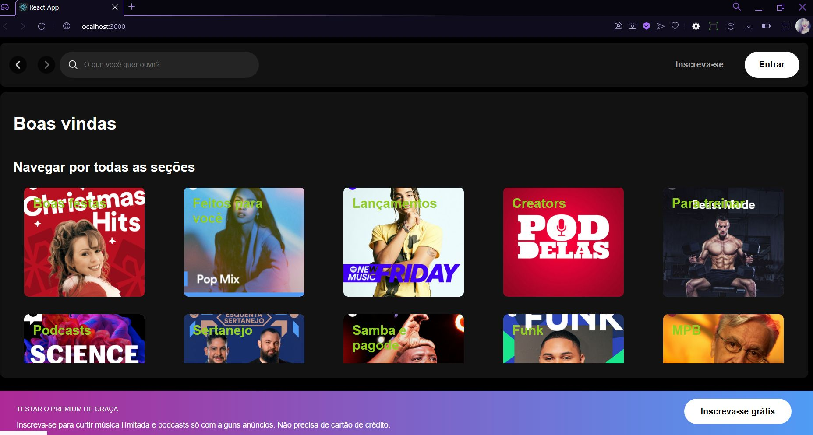

<h1 align="center">Spotify</h1>

Projeto desenvolvido na imersão Front-End da Alura

  <a href="#-tecnologias">Tecnologias</a>&nbsp;&nbsp;&nbsp;|&nbsp;&nbsp;&nbsp;
  <a href="#-projeto">Projeto</a>&nbsp;&nbsp;&nbsp;|&nbsp;&nbsp;&nbsp;
  <a href="#-layout">Layout</a>&nbsp;&nbsp;&nbsp;|&nbsp;&nbsp;&nbsp;
  <a href="#memo-licença">Licença</a>

  

 

  

## 🚀 Tecnologias

Esse projeto foi desenvolvido com as seguintes tecnologias:

- HTML e CSS
- JavaScript
- React

## 💻 Projeto

O Site foi desenvolvido com base no do Spotify, ele é funcional, podendo ser navegado e procurar alguns cantores.

## 🔖 Layout

  

## :memo: Licença

Esse projeto está sob a licença MIT.